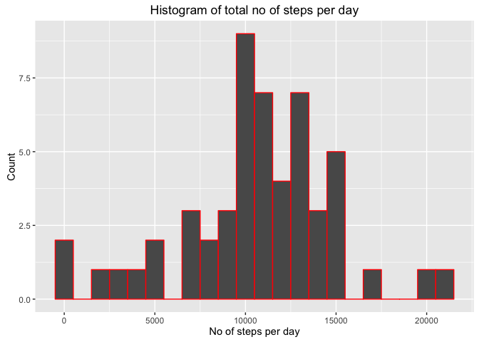
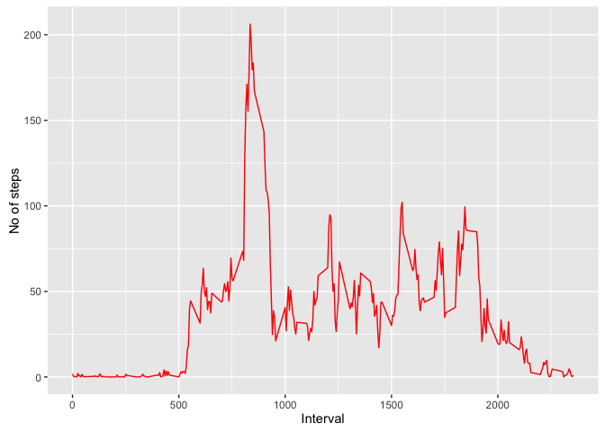
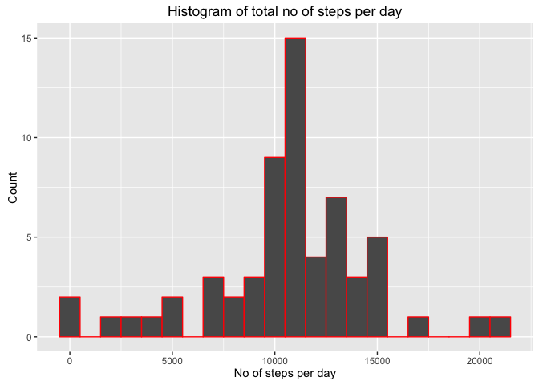
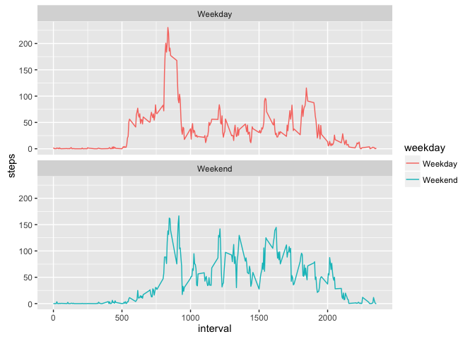

# Reproducible Research: Peer Assessment 1
## Introduction
This is the first project for Reproducible Research course as part of Data Science specialization. This project makes use of data from a personal activity monitoring device and answers questions asked in this project.

The data can be downloaded from course website and detail information regarding questions can be found in readme file.

## Loading and preprocessing the data

```r
# Load the respective package used in this script
library(ggplot2)
library(dplyr)
```

```
## 
## Attaching package: 'dplyr'
```

```
## The following objects are masked from 'package:stats':
## 
##     filter, lag
```

```
## The following objects are masked from 'package:base':
## 
##     intersect, setdiff, setequal, union
```

```r
library(lubridate)
```

```
## 
## Attaching package: 'lubridate'
```

```
## The following object is masked from 'package:base':
## 
##     date
```

```r
#Unzip and read the data
unzip(zipfile = "activity.zip")
data <- read.csv("activity.csv", header=TRUE, sep=",")
#head(data)
data$date <- ymd(data$date)
```


## What is mean total number of steps taken per day?

```r
# filter na from data and group by date
no_steps <- data %>% filter(!is.na(steps)) %>%
            group_by(date) %>% summarize(steps = sum(steps)) %>%
            print 
```

```
## # A tibble: 53 x 2
##          date steps
##        <date> <int>
## 1  2012-10-02   126
## 2  2012-10-03 11352
## 3  2012-10-04 12116
## 4  2012-10-05 13294
## 5  2012-10-06 15420
## 6  2012-10-07 11015
## 7  2012-10-09 12811
## 8  2012-10-10  9900
## 9  2012-10-11 10304
## 10 2012-10-12 17382
## # ... with 43 more rows
```

```r
ggplot(no_steps, aes(x = steps)) + 
  geom_histogram(binwidth = 1000, col="Red") + 
  labs(x="No of steps per day", y="Count", title="Histogram of total no of steps per day")
```

<!-- -->

```r
mean <- mean(no_steps$steps, na.rm=TRUE)
mean
```

```
## [1] 10766.19
```

```r
median <- median(no_steps$steps, na.rm=TRUE)
median
```

```
## [1] 10765
```


## What is the average daily activity pattern?

```r
avg_interval <- data %>% filter(!is.na(steps)) %>% 
  group_by(interval) %>%  summarize(steps = mean(steps)) %>%
  print 
```

```
## # A tibble: 288 x 2
##    interval     steps
##       <int>     <dbl>
## 1         0 1.7169811
## 2         5 0.3396226
## 3        10 0.1320755
## 4        15 0.1509434
## 5        20 0.0754717
## 6        25 2.0943396
## 7        30 0.5283019
## 8        35 0.8679245
## 9        40 0.0000000
## 10       45 1.4716981
## # ... with 278 more rows
```

```r
avg_interval[which.max(avg_interval$steps), ]
```

```
## # A tibble: 1 x 2
##   interval    steps
##      <int>    <dbl>
## 1      835 206.1698
```

```r
ggplot(avg_interval, aes(x = interval, y=steps)) + geom_line(color="Red") + 
  labs(x="Interval", y="No of steps")
```

<!-- -->


## Imputing missing values

```r
# find total no of missing values in data
missing <- sum(is.na(data$steps))
missing
```

```
## [1] 2304
```

```r
# replace missing values with average no of steps per 5 min interval
datawith_na <- is.na(data$steps)
avg <- tapply(data$steps, data$interval, mean, na.rm =TRUE)
data$steps[datawith_na] <- avg[as.character(data$interval[datawith_na])]

sum(is.na(data$steps))
```

```
## [1] 0
```

```r
no_steps_na <- data %>% filter(!is.na(steps)) %>%
  group_by(date) %>% summarize(steps = sum(steps)) %>%
  print 
```

```
## # A tibble: 61 x 2
##          date    steps
##        <date>    <dbl>
## 1  2012-10-01 10766.19
## 2  2012-10-02   126.00
## 3  2012-10-03 11352.00
## 4  2012-10-04 12116.00
## 5  2012-10-05 13294.00
## 6  2012-10-06 15420.00
## 7  2012-10-07 11015.00
## 8  2012-10-08 10766.19
## 9  2012-10-09 12811.00
## 10 2012-10-10  9900.00
## # ... with 51 more rows
```

```r
ggplot(no_steps_na, aes(x = steps)) + 
  geom_histogram(binwidth = 1000, col="Red") + 
  labs(x="No of steps per day", y="Count", title="Histogram of total no of steps per day")
```

<!-- -->

```r
mean_wihout_na <- mean(no_steps_na$steps, na.rm=TRUE)
median_without_na <- median(no_steps_na$steps, na.rm=TRUE)

#Differce between imputed and non imputed data
meandiff <- mean - mean_wihout_na
mediandiff <- median - median_without_na

diff <- sum(no_steps$steps) - sum(no_steps_na$steps)
```


## Are there differences in activity patterns between weekdays and weekends?

```r
data <- mutate(data, weekday = ifelse(weekdays(data$date) == "Saturday" | weekdays(data$date) == "Sunday", "Weekend", "Weekday"))
data$weekday <- as.factor(data$weekday)
#head(data)

avg_interval <- data  %>% group_by(interval, weekday) %>%  
              summarize(steps = mean(steps)) %>%
              print 
```

```
## Source: local data frame [576 x 3]
## Groups: interval [?]
## 
##    interval weekday       steps
##       <int>  <fctr>       <dbl>
## 1         0 Weekday 2.251153040
## 2         0 Weekend 0.214622642
## 3         5 Weekday 0.445283019
## 4         5 Weekend 0.042452830
## 5        10 Weekday 0.173165618
## 6        10 Weekend 0.016509434
## 7        15 Weekday 0.197903564
## 8        15 Weekend 0.018867925
## 9        20 Weekday 0.098951782
## 10       20 Weekend 0.009433962
## # ... with 566 more rows
```

```r
ggplot(avg_interval, aes(x=interval, y=steps, color=weekday)) +
              geom_line() + facet_wrap(~weekday, nrow=2, ncol=1)
```

<!-- -->
